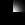
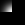
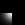
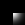
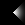
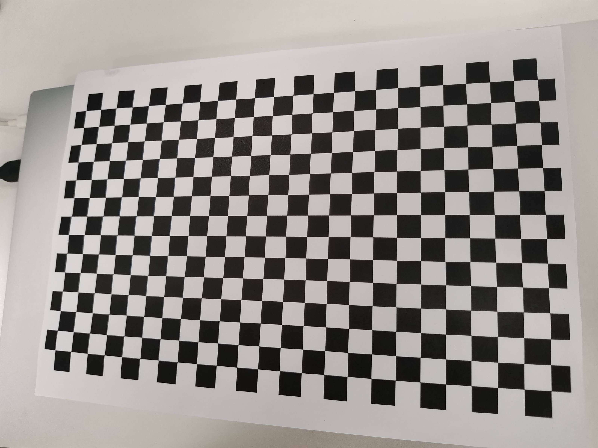
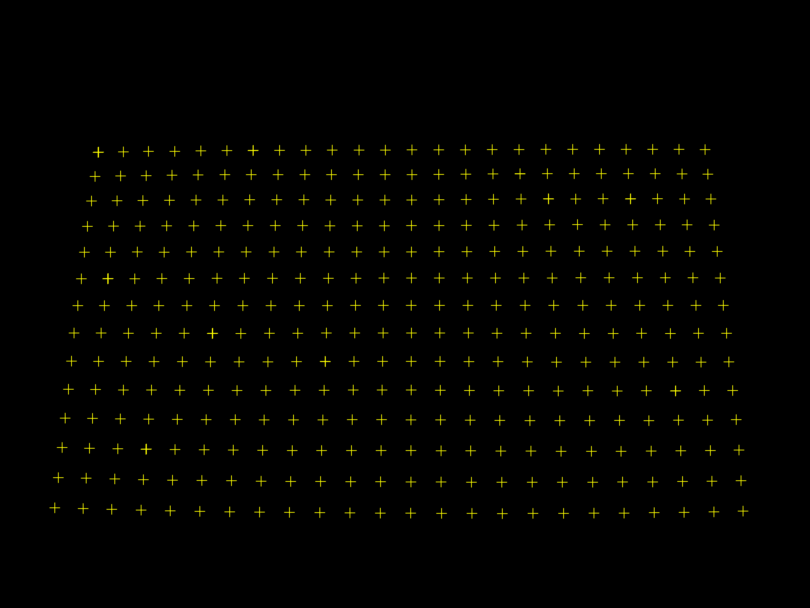
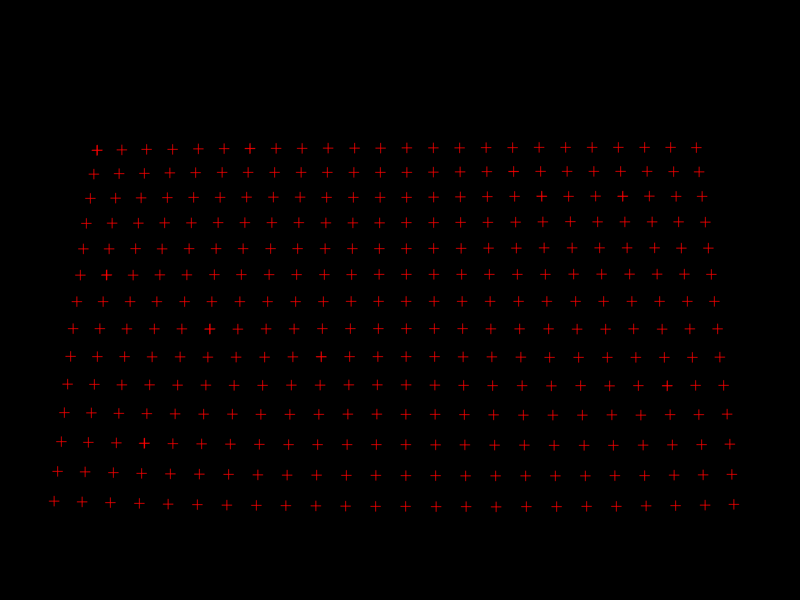
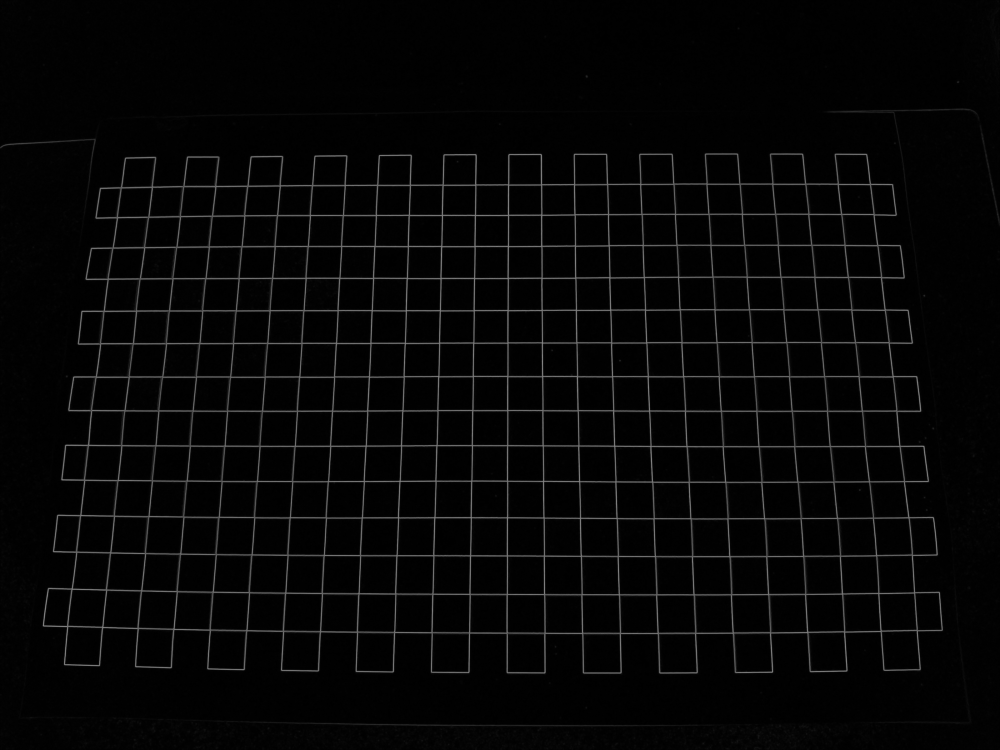
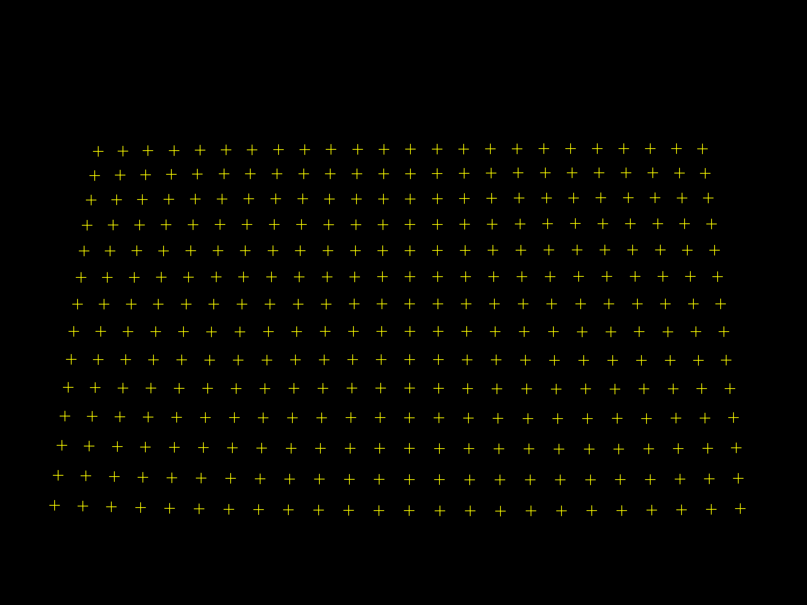

# A CPP Class to Locating chessboard corners
>___Author : csl___  
>___E-mail : 3079625093@qq.com___ 

## OverView

### Corner detection in checkerboard is one of the essential steps in camera calibration.  
Based on this, a new detection method is introduced today. Mainly refer to the paper automatic camera and range sensor calibration using a single shot. It can solve the above problems.
advantage:
1. You do not need to specify the number of checkerboards in advance.
2. Good robustness. Because it is a growth based algorithm, if there is interference, it will bypass the interference and grow the largest chessboard.
3. It can detect the situation that a picture contains multiple checkerboards.  

Disadvantages:
1. Constrained by the rectangular shape of the chessboard, only a rectangular chessboard can be grown. Strictly speaking, it can't be regarded as a disadvantage, because the chessboard itself is rectangular. Can it be called a chessboard if it really grows three heads and six arms. However, I will introduce a method that does not rely on chessboard constraints in the future.
2. Large amount of calculation. Mainly concentrated in the growing part of the chessboard.

## Prototypes
>___prototypes : [0,180]___  

        

>___prototypes : [45,135]___ 

         

## Process
>___src___ 

  

>___nonMaximumSuppression___ 



>___edgeOrientations___ 



>___registerCorners___ 


>___weight___ 



>___mapping___   



>___result___ 


## Result
>___part___  
```cpp
389,600,0,0
487,599,0.091,0
586,597,0.182,0
690,597,0.273,0
793,595,0.364,0
896,594,0.455,0
999,594,0.546,0
1104,593,0.637,0
1208,593,0.728,0
1312,592,0.819,0
1418,592,0.91,0
1522,592,1.001,0
1627,591,1.092,0
1733,591,1.183,0
1838,591,1.274,0
1944,590,1.365,0
2050,590,1.456,0
2156,589,1.547,0
2262,589,1.638,0
2368,589,1.729,0
2473,589,1.82,0
2578,589,1.911,0
2682,589,2.002,0
2785,590,2.093,0
375,696,0,0.091
476,694,0.091,0.091
577,693,0.182,0.091
679,691,0.273,0.091
782,690,0.364,0.091
888,689,0.455,0.091
992,689,0.546,0.091
1098,689,0.637,0.091
1204,689,0.728,0.091
1309,689,0.819,0.091
1415,689,0.91,0.091
1521,689,1.001,0.091
1627,689,1.092,0.091
1733,688,1.183,0.091
1840,687,1.274,0.091
1947,686,1.365,0.091
2054,685,1.456,0.091
2162,685,1.547,0.091
2268,685,1.638,0.091
2375,685,1.729,0.091
2482,685,1.82,0.091
2588,685,1.911,0.091
2694,686,2.002,0.091
2796,687,2.093,0.091
361,793,0,0.182
462,792,0.091,0.182
```

## Methods
```cpp

#pragma region static class Gaussian
    template <typename _Ty>
    class Gaussian
    {
    public:
        using value_type = _Ty;

    private:
        Gaussian() = default;

    public:
        // the max value is sigma * std::sqrt(2.0 * M_PI)
        static value_type gaussian(value_type x, value_type mean, value_type sigma);
        // the max value is 1
        static value_type gaussianNormalized(value_type x, value_type mean, value_type sigma);
    };

    template <typename _Ty>
    typename Gaussian<_Ty>::value_type Gaussian<_Ty>::gaussian(value_type x, value_type mean, value_type sigma)
    {
        return Gaussian<_Ty>::gaussianNormalized(x, mean, sigma) / (sigma * std::sqrt(2.0 * M_PI));
    }

    template <typename _Ty>
    typename Gaussian<_Ty>::value_type Gaussian<_Ty>::gaussianNormalized(value_type x, value_type mean, value_type sigma)
    {
        return std::pow(M_E, -0.5 * (std::pow((x - mean) / sigma, 2)));
    }
#pragma endregion

#pragma region ceres cost function

    /**
     * \brief The corner points of interference are removed by fitting the normal curve
     */
    struct CostFun
    {
        int _x;
        int _y;
        CostFun(int x, int y) : _x(x), _y(y) {}
        // two params : mu, sigma
        bool operator()(const double *const params, double *out) const;
    };

#pragma endregion

#pragma region class CBDector
    /**
     * \brief the main class to find chessboard corners
     */
    class CBDector
    {
    public:
        using cornerPrototype = std::array<cv::Mat, 4>;

    private:
        // CV_8UC3
        cv::Mat _imgSrc;
        // CV_8UC1
        cv::Mat _imgGray;
        // CV_8UC1
        cv::Mat _imgLikehood;
        // CV_32FC1
        cv::Mat _imgAngle;
        // CV_32FC1
        cv::Mat _imgWeight;
        /**
         *  \brief two template types to convolute with image
         *  _type1 : horizontal direction
         *  _type2 : Tilt 45 degrees direction
         */
        cornerPrototype _type1;
        cornerPrototype _type2;

        /**
         * \brief the structure carrying corner information
         */
        struct ChessCorner
        {
            // the pixel position
            cv::Point _pos;
            // the gray grad of this position
            cv::Point2f _grad;
            // the scores
            float _score;
        };

        /**
         * \brief a structure to graw the hold chessboard
         */
        struct ChessBoard
        {
            // the size of the chessboard
            int _rows;
            int _cols;

            std::vector<cv::Point2f> _corners;

            ChessBoard() = delete;

            ChessBoard(int r, int c) : _rows(r), _cols(c), _corners(r * c, cv::Point2f()) {}

            // get one element at the position
            const cv::Point2f &operator()(int r, int c) const;

            cv::Point2f &operator()(int r, int c);

            // add one row on top
            void addRowUp();

            // add one row on bottom
            void addRowDown();

            // add one col at left
            void addColLeft();

            // add one col at right
            void addColRight();
        };

        // the init chessboard
        ChessBoard _chessboard = ChessBoard(3, 3);

        // position[x, y] and the two main direction
        std::list<ChessCorner> _candidates;

        // the coeners
        std::vector<ChessCorner> _corners;

        // the center of the chessboard
        ChessCorner _center;

        /**
         *  a structure to organize the result
         */
        struct Mapping
        {
            cv::Point2f _pixel;
            cv::Point2f _real;
        };

        // the result
        std::vector<Mapping> _mapping;

    public:
        CBDector() = delete;

        // read the image and init this algorithm
        CBDector(const std::string &imagePath) : _imgSrc(cv::imread(imagePath, cv::IMREAD_COLOR)) { this->init(); }

        // run the algorithm
        void process(std::string imgOutputDir, float blockSize);

        // get the result
        std::vector<Mapping> &getMapping() { return this->_mapping; }

    private:
        // calculate the direction from start to end
        static float direction(const cv::Point2f &start, const cv::Point2f &end);

        // judgement for angle range
        static bool isInRange(float start_radian, float end_radian, float target);

        // calculate the distance between p1 and p2
        static float distance(const cv::Point2f &p1, const cv::Point2f &p2);

        // it's used in the init function to create two kinds of proto template
        static cv::Mat createCornerPrototype(float start_radian, float end_radian, int size);

        // output something on the console
        static void outputInConsole(const std::string &words);

        // use mean shift algorithm to find two extremums
        static std::pair<int, int> findModesMeanShift(const std::array<float, 32> &hist);

        // translate the grad[radian] to a direction vector
        static cv::Vec2f gradVector(float grad);

        // calculate the energy of this chessboard
        float chessboard_energy(const ChessBoard &chessboard);

        // find corner at the director
        ChessCorner &findCorner(const cv::Vec2f &dir, const ChessCorner &p);

        // direction is [left]
        ChessCorner &findCornerLeft(const ChessCorner &center);

        // direction is [right]
        ChessCorner &findCornerRight(const ChessCorner &center);

        // direction is [up]
        ChessCorner &findCornerUp(const ChessCorner &center);

        // direction is [down]
        ChessCorner &findCornerDown(const ChessCorner &center);

        // to predict the corners
        pcl::PointXY predictCorners(const cv::Point2f &p1, const cv::Point2f &p2, const cv::Point2f &p3);

        // calculate the likehood based on the gray image
        void calCornerLikehood();

        // use NMS algorithm to erase some bad corner candidates
        void nonMaximumSuppression();

        // calculate  the edge orientation
        void edgeOrientations();

        // register corners
        void registerCorners();

        // graw the chessboard
        void grawChessBoard();

        // get the mapping relationship
        void organizationMapping(float blockSize);

        // init this algorithm
        void init();
    };
#pragma endregion
```