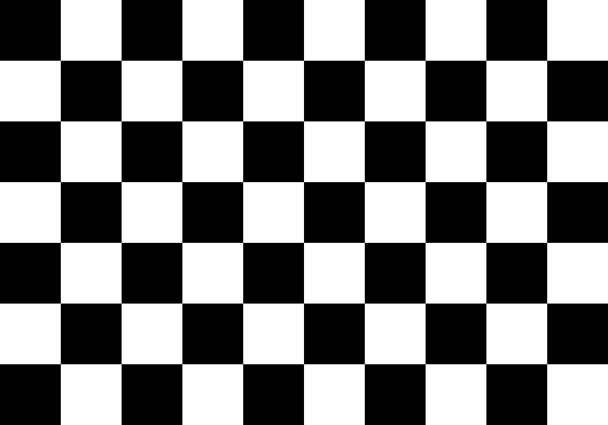
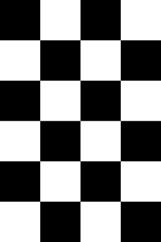

# Create the ChessBoard Image
>___Author : csl___  
>___E-mail : 3079625093@qq.com___
---
[TOC]

## 1. Overview

Checkerboard: commonly used for camera calibration. This program provides the generation function of checkerboard pictures. Users can set the size of checkerboard and the size of each grid as needed.

---
## 2. Thirdparty
>___OpenCV___
>
>___flags___

## 3. Display
+ ___[100-7-10]___



+ ___[80-6-4]___

```shell
./chessboard ../images/board-80-6-4.png --size 80 --rows 6 --cols 4
```




## 4. Details

```cpp
cv::Mat board(rows * size, cols * size, CV_8UC1, cv::Scalar(255));

for (int i = 0; i != rows; ++i) {
    for (int j = 0; j != cols; ++j) {
        if ((i + j) % 2 == 0) {
            board(cv::Rect2i(j * size, i * size, size, size)).setTo(0);
        }
    }
}

cv::imwrite(path, board);
```