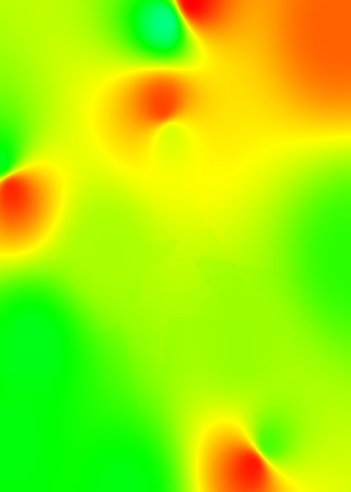
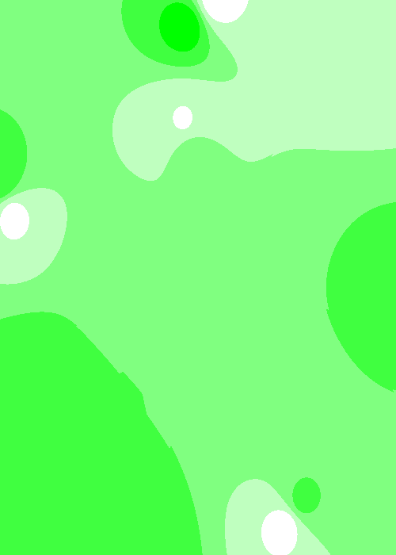

# Value-Color Projection

>___Author : csl___   
>___E-Mail : 3079625093@qq.com___

## OverView

### Projecting values into color ranges is a basic function of data visualization. This program is based on RGB color model and HSV color model to project the numerical interval into the color space.

## Data
```cpp
// [x,y,z,i]
// we project the i to the color space
0.0769819,0.474645,0,4.83197
0.0769819,0.492425,0,4.8301
0.0769819,0.510205,0,4.82822
0.0769819,0.527986,0,4.82634
0.0769819,0.545766,0,4.82445
0.0769819,0.563546,0,4.82257
0.0769819,0.581326,0,4.82068
0.0769819,0.599106,0,4.81879
0.0769819,0.616886,0,4.8169
```

## Result
>___no classify___   



>___classify___   


>___isReversal___   



## Details

```cpp
#pragma once

#include <cmath>
#include <iostream>
#include <tuple>

namespace ns_clp {
  using rgb = std::tuple<int, int, int>;
  using hsv = std::tuple<float, float, float>;
  
  /**
   * \brief translate the hsv color space to rgb color space
   *
   */
  rgb trans(const hsv &val);

  /**
   * \brief different color types for the projection
   */
  namespace Color {
    enum class Elem {
      Hue,
      Saturation,
      Value
    };
    /**
     * \brief define your own color style by writing this structure
     *        the [_min, _max] means the change range, it's for
     *        h[0.0, 360.0],
     *        s[0.0, 1.0],
     *        v[0.0, 1.0]
     *        and the [_hsv] points the change elem.
     * \attention for example, ColorTypw{0.0, 180.0, 1.0, 0.5, Elem::Hue}
     *        it means:
     *        h[0.0, 180.0],
     *        s = 1.0,
     *        v = 0.5
     */
    struct ColorType {
      float _min;
      float _max;
      float _v1;
      float _v2;
      Elem _hsv;
    };

    /**
     *
     * \brief color types
     */
    constexpr static ColorType red_yellow{0.0, 60.0, 1.0, 1.0, Elem::Hue};
    constexpr static ColorType yellow_green{45.0, 130.0, 1.0, 1.0, Elem::Hue};
    constexpr static ColorType green_cyan{100.0, 190.0, 1.0, 1.0, Elem::Hue};
    constexpr static ColorType cyan_blue{180.0, 240.0, 1.0, 1.0, Elem::Hue};
    constexpr static ColorType blue_purple{220.0, 300.0, 1.0, 1.0, Elem::Hue};
    constexpr static ColorType purple_red{290.0, 360.0, 1.0, 1.0, Elem::Hue};

    constexpr static ColorType panchromatic{0.0, 360.0, 1.0, 1.0, Elem::Hue};

    constexpr static ColorType red{0.0, 1.0, 360.0, 1.0, Elem::Saturation};
    constexpr static ColorType pink{0.0, 1.0, 340.0, 1.0, Elem::Saturation};
    constexpr static ColorType purple{0.0, 1.0, 310.0, 1.0, Elem::Saturation};
    constexpr static ColorType blue{0.0, 1.0, 240.0, 1.0, Elem::Saturation};
    constexpr static ColorType cyan{0.0, 1.0, 190.0, 1.0, Elem::Saturation};
    constexpr static ColorType green{0.0, 1.0, 120.0, 1.0, Elem::Saturation};
    constexpr static ColorType yellow{0.0, 1.0, 60.0, 1.0, Elem::Saturation};
    constexpr static ColorType orange{0.0, 1.0, 20.0, 1.0, Elem::Saturation};

    constexpr static ColorType gray{0.0, 1.0, 0.0, 0.0, Elem::Value};
    constexpr static ColorType red_yellow_green{0.0, 150.0, 1.0, 1.0, Elem::Hue};
    constexpr static ColorType yellow_green_cyan{50.0, 180.0, 1.0, 1.0, Elem::Hue};
    constexpr static ColorType green_cyan_blue{50.0, 250.0, 1.0, 1.0, Elem::Hue};
    constexpr static ColorType cyan_blue_purple{180.0, 300.0, 1.0, 1.0, Elem::Hue};
    constexpr static ColorType blue_purple_red{240.0, 360.0, 1.0, 1.0, Elem::Hue};
    constexpr static ColorType cold{180.0, 360.0, 1.0, 1.0, Elem::Hue};
    constexpr static ColorType worm{0.0, 180.0, 1.0, 1.0, Elem::Hue};
  };

  rgb project(float val, float min, float max,
              bool isReversal = false, int classify = 0,
              const Color::ColorType &color = Color::gray);

} // namespace ns_clp
```