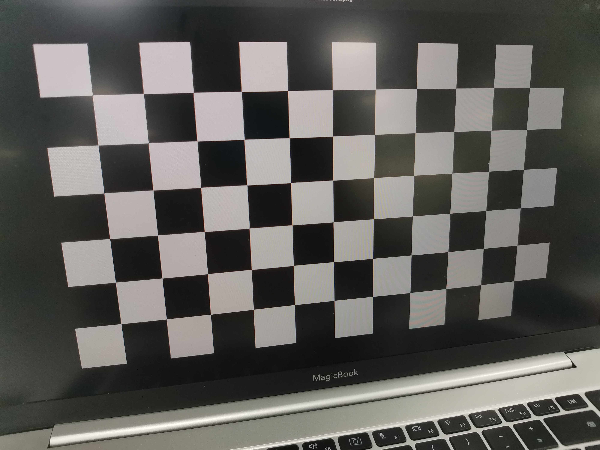
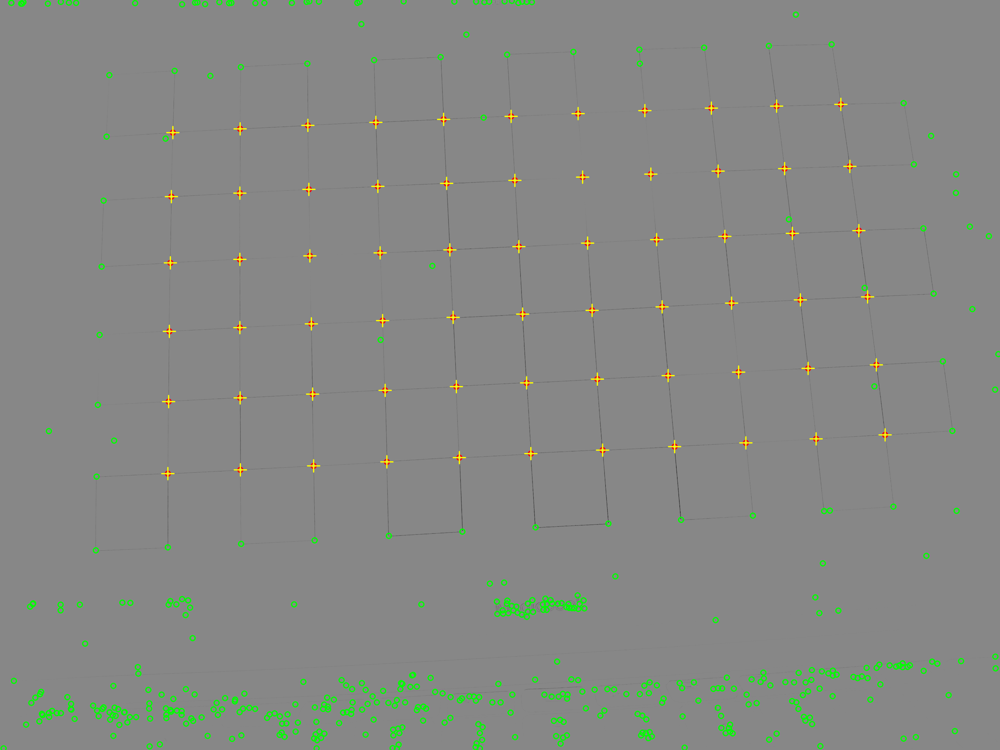
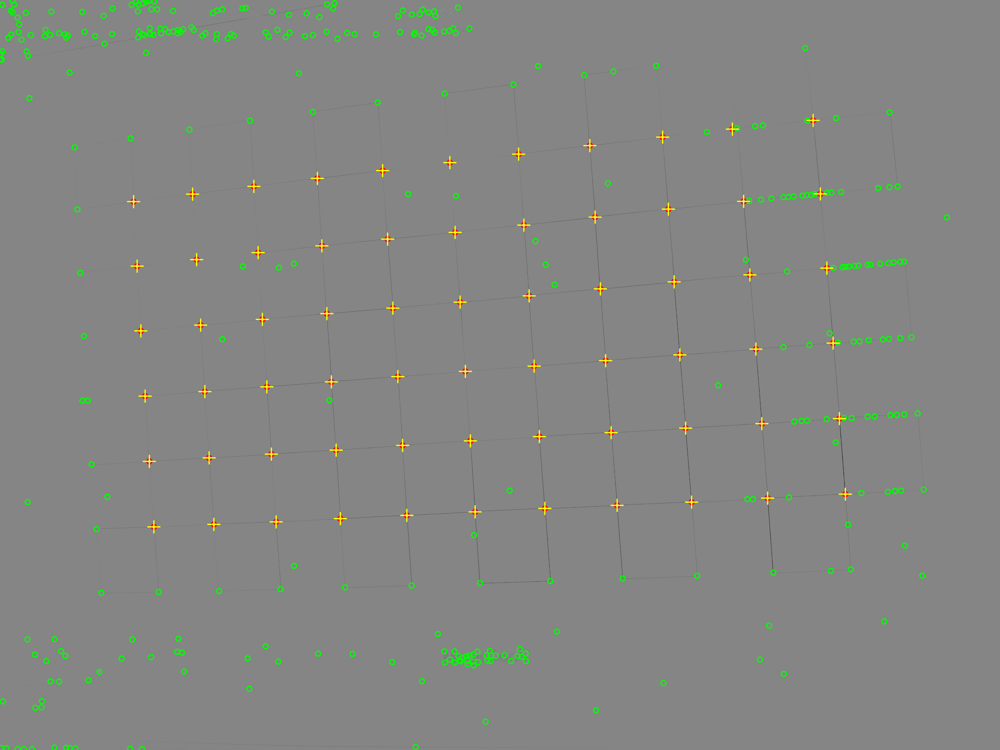

# A Semi Automatic Chessboard Corner Extraction Class
>___Author : csl___  
>___E-mail : 3079615093@qq.com___
## 1.Overview
### This program realizes semi-automatic chessboard corner extraction, the interface is simple, and the accuracy of corner extraction is guaranteed. 
## 2.Usage
>___Step 1___  
### Prepare a picture with a chessboard, and obtain the number of rows and columns of the chessboard, as well as the size of the grid.
>___Step 2___  
### using the method:
```cpp
static void doSearch(const std::string &imagePath, int rows, int cols, float realBlockSize, float threshold);
```
### to do the search, you may need to control the params of threshold.
>___Step 3___
### Select corners in the window with the mouse, Select point: draw a rectangle with the left mouse button to select, Delete selected point: right click.  
>___Step 4___
### sort the selected corners by drawing a line with the mouse in the window, Select a point: draw a line with the left mouse button  
>___Step 5___
### After that, you can get the result by using: 
```cpp
static std::vector<std::pair<cv::Point2f, cv::Point2f>> &getMapping();
```

## 3.Display
>___Src___  



>___Select corners___  


>___Select corners___  



>___Draw line to sort the corners___  


>___Draw line to sort the corners___  



>___Result___
```cpp
618.63,636.037,0,0
959.167,626.333,0.022,0
1291.52,617.957,0.044,0
1611,611.826,0.066,0
1920.69,607.115,0.088,0
2217.31,601.577,0.11,0
2503.28,597.278,0.132,0
2778.7,592.65,0.154,0
3041.7,590.174,0.176,0
3293,588.381,0.198,0
3532.4,588.15,0.22,0
656,969.042,0,0.022
990.792,954.875,0.022,0.022
1315.89,941.167,0.044,0.022
1630.33,931.852,0.066,0.022
1930.78,921.63,0.088,0.022
2220.05,910.286,0.11,0.022
2500.16,898.158,0.132,0.022
2769.4,887.8,0.154,0.022
3028.5,878.5,0.176,0.022
3276.16,871.053,0.198,0.022
3512.35,864.412,0.22,0.022
695.75,1288.75,0,0.044
1022.21,1270.17,0.022,0.044
1341.52,1252.05,0.044,0.044
1647.56,1234.92,0.066,0.044
1940.79,1220.38,0.088,0.044
2221.42,1203.53,0.11,0.044
2494.89,1186.68,0.132,0.044
2760.5,1171,0.154,0.044
3014.88,1156.88,0.176,0.044
3258.57,1143.61,0.198,0.044
3491.43,1131.62,0.22,0.044
734.167,1593.42,0,0.066
1052.6,1569.92,0.022,0.066
1365.42,1545.96,0.044,0.066
1664.29,1523.77,0.066,0.066
1949.27,1501.91,0.088,0.066
2223.42,1481.54,0.11,0.066
2490.78,1461.72,0.132,0.066
2751.27,1442.32,0.154,0.066
3001.16,1423.68,0.176,0.066
3242.04,1405.36,0.198,0.066
3470.05,1388.86,0.22,0.066
770.667,1884.58,0,0.088
1082.04,1855.46,0.022,0.088
1385.74,1826.96,0.044,0.088
1678.29,1798.54,0.066,0.088
1957.55,1771.82,0.088,0.088
2226.27,1747.41,0.11,0.088
2488.21,1725.05,0.132,0.088
2742.78,1702.44,0.154,0.088
2988.05,1680.65,0.176,0.088
3223.5,1658.5,0.198,0.088
3448.67,1636.95,0.22,0.088
809.522,2160.7,0,0.11
1111.36,2128.82,0.022,0.11
1405.5,2097,0.044,0.11
1690.82,2064.41,0.066,0.11
1965.12,2033.75,0.088,0.11
2229.57,2005.24,0.11,0.11
2486.63,1978.63,0.132,0.11
2734.82,1952.64,0.154,0.11
2975.32,1926.37,0.176,0.11
3205.89,1900.67,0.198,0.11
3426.65,1875.41,0.22,0.11
``` 
## 4.thridparty
>___PCL___   

>___Eigen3___   

>___OpenCV___   

>___harris[personal static class]___

>___Ceres___

## 5.Methods
```cpp
     class CornerSelector
    {
    public:
        struct Linefitting
        {
            cv::Point2f _p;
            Linefitting(const cv::Point2f &p) : _p(p) {}

            bool operator()(const double *const params, double *out) const;
            // bool opertaor()(const double* const params, double *out) const;
        };

    private:
        CornerSelector() = default;
        /**
         * \brief Lets you select corners in the window with the mouse
         *        Select point: draw a rectangle with the left mouse button to select
         *        Delete selected point: right click
         */
        static void onMouse_select_corners(int event, int x, int y, int flags, void *userdata);

        /**
         * \brief Used to sort the selected corners by drawing a line with the mouse in the window
         *        Select a point: draw a line with the left mouse button
         */
        static void onMouse_sort_corners(int event, int x, int y, int flags, void *userdata);

        /**
         * \brief fitting the line by using ceres librarys
         */ 
        static cv::Point2f fittingLine(const std::vector<cv::Point2f> &points);

        // two points of the rect
        static cv::Point2f p1;
        static cv::Point2f p2;

        /**
         *  the points after decreasing number
         *  bool = true when is  selected
         */
        static std::list<std::pair<cv::Point2f, bool>> less;

        // kd-tree used to find near points fast
        static pcl::KdTreeFLANN<pcl::PointXY> kdtree;

        // the display image
        static cv::Mat dst;

        /**
         * \brief the fileds of the chess board
         */
        static int rows;
        static int cols;
        static float blockSize;

        // count the selected points' number
        static int selected;

        // the selected corners
        // the bool means isOrdered
        static std::vector<std::pair<cv::Point2f, bool>> corners;

        // the image point and the real world point
        static std::vector<std::pair<cv::Point2f, cv::Point2f>> mapping;

        // judge the mouse event when sort the points
        static bool isSorting;
        /**
         * \brief  this value control the precision of the corner detector
         *         greater value, more running time, high precision
         *         usually get 1.0 or 2.0
         */
    public:
        // main functions

        /**
         * \brief calculate the distance from the line[Ax + By + 1.0 = 0.0] to p
         */
        static double distance(const cv::Point2f &lineParams, const cv::Point2f &p);

        /**
         * \brief calculate the distance from the line[lp1, lp2] to p
         */
        static float distance(const cv::Point2f &lp1, const cv::Point2f &lp2, const cv::Point2f &p);
        /**
         * \brief search corner and create the mapping on the image
         * \param imagePath the chessboard image path
         * \param rows the rows of the chessboard
         * \param cols the cols of the chessboard
         * \param realBlockSize the size of the chessboard on real world
         * \param threshold the value to control the detected points' num in the harris algorithm
         * \param combineSize the size to combine in the kd-tree
         * \param isColor the display image type
         */
        static void doSearch(const std::string &imagePath, int rows, int cols, float realBlockSize, float threshold, float combineSize = 20, bool isColor = false);

        /**
         * \brief get the mapping
         *        [image pos], [real pos]
         */
        static std::vector<std::pair<cv::Point2f, cv::Point2f>> &getMapping();
    };
```