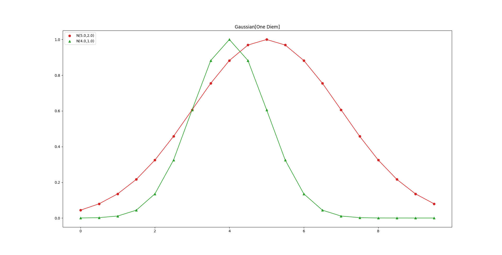
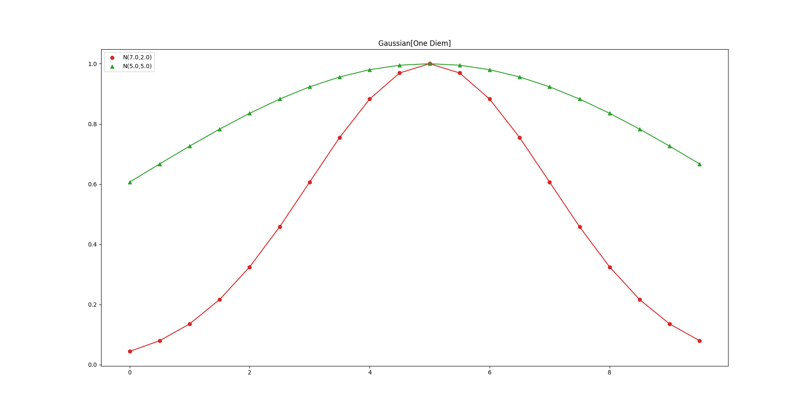
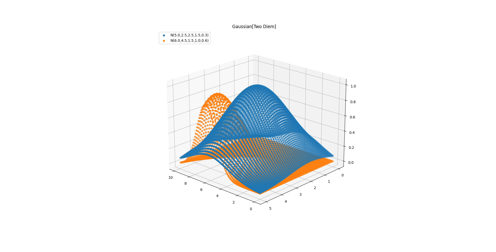
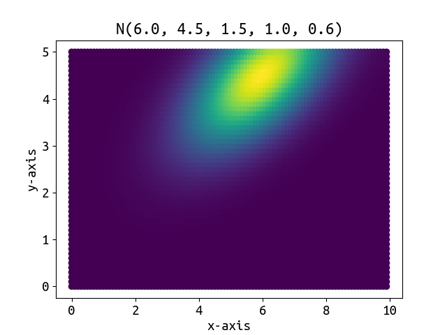
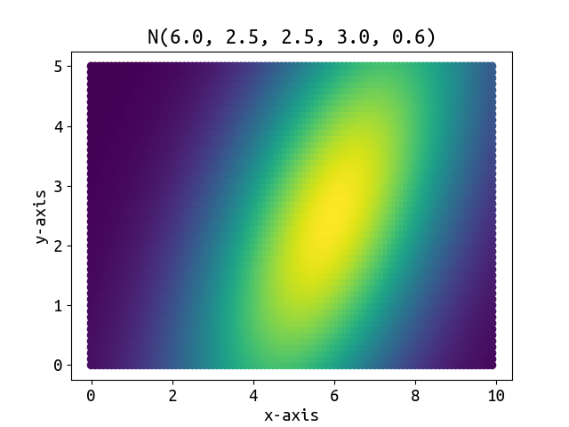

# Gaussion Function Calculation
>___Author : csl___  
>___E-Mail : 3079625093@qq.com___
## OverView
### This is a template cpp static class for gaussian function calculation, and it runs well for both one-dimensional data and two-dimensional data.
---
## Images


## Usage
```cpp
int main(int argc, char const *argv[])
{
    for (float x = 0.0; x < 10.0; x += 0.5)
        std::cout << x << ',' << ns_gaussian::Gaussian<float>::gaussianNormalized(x, 5.0, 2.0) << std::endl;

    std::vector<double> vec;
    for (float x = 0.0; x < 10.0; x += 0.5)
        for (float y = 0.0; y < 5.0; y += 0.5)
            std::cout << x << ',' << y << ',' << ns_gaussian::Gaussian<float>::gaussianNormalized(x, y, 5.0, 2.5, 2.5, 1.5, 0.3);
    return 0;
}
```


## Details
```cpp
#pragma region static class Gaussian
    /**
     * \brief a template cpp static class for gaussian function calculation,
     *        and it runs well for both one-dimensional data and two-dimensional data.
     */
    template <typename _Ty>
    class Gaussian
    {
    public:
        using value_type = _Ty;

    private:
        Gaussian() = delete;
        
        Gaussian(const Gaussian &g) = delete;

    public:
        /**
         *  \brief the max value is [1.0 / sigma * std::sqrt(2.0 * M_PI)],
         *         and it is for one-dimensional data
         */
        static value_type gaussian(value_type x, value_type mean, value_type sigma);
        /**
         * \brief the max value is 1.0,
         *        and it is for one-dimensional data
         */
        static value_type gaussianNormalized(value_type x, value_type mean, value_type sigma);

        /**
         *  \brief the max value is [1.0 / 2 * M_PI * sigma_x * sigma_y * std::sqrt(1 - rou * rou)],
         *         and it is for two-dimensional data
         */
        static value_type gaussian(value_type x, value_type y,
                                   value_type mean_x, value_type mean_y,
                                   value_type sigma_x, value_type sigma_y,
                                   value_type rou);
        /**
         * \brief the max value is 1.0,
         *        and it is for two-dimensional data
         */
        static value_type gaussianNormalized(value_type x, value_type y,
                                             value_type mean_x, value_type mean_y,
                                             value_type sigma_x, value_type sigma_y,
                                             value_type rou);
    };

    template <typename _Ty>
    typename Gaussian<_Ty>::value_type Gaussian<_Ty>::gaussian(value_type x, value_type mean, value_type sigma)
    {
        return Gaussian<_Ty>::gaussianNormalized(x, mean, sigma) / (sigma * std::sqrt(2.0 * M_PI));
    }

    template <typename _Ty>
    typename Gaussian<_Ty>::value_type Gaussian<_Ty>::gaussianNormalized(value_type x, value_type mean, value_type sigma)
    {
        return std::pow(M_E, -0.5 * (std::pow((x - mean) / sigma, 2)));
    }

    template <typename _Ty>
    typename Gaussian<_Ty>::value_type Gaussian<_Ty>::gaussian(value_type x, value_type y,
                                                               value_type mean_x, value_type mean_y,
                                                               value_type sigma_x, value_type sigma_y,
                                                               value_type rou)
    {
        return Gaussian<_Ty>::gaussianNormalized(x, y, mean_x, mean_y, sigma_x, sigma_y, rou) /
               (2 * M_PI * sigma_x * sigma_y * std::sqrt(1 - rou * rou));
    }

    template <typename _Ty>
    typename Gaussian<_Ty>::value_type Gaussian<_Ty>::gaussianNormalized(value_type x, value_type y,
                                                                         value_type mean_x, value_type mean_y,
                                                                         value_type sigma_x, value_type sigma_y,
                                                                         value_type rou)
    {
        auto v1 = -0.5 / (1.0 - rou * rou);
        auto v2 = std::pow((x - mean_x) / sigma_x, 2);
        auto v3 = 2 * rou * (x - mean_x) * (y - mean_y) / (sigma_x * sigma_y);
        auto v4 = std::pow((y - mean_y) / sigma_y, 2);
        return std::pow(M_E, v1 * (v2 - v3 + v4));
    }
#pragma endregion

```