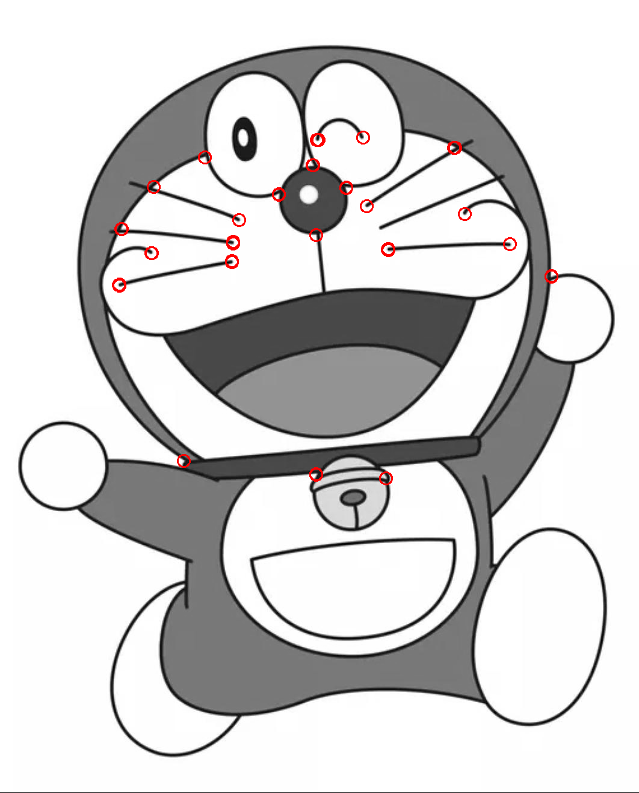
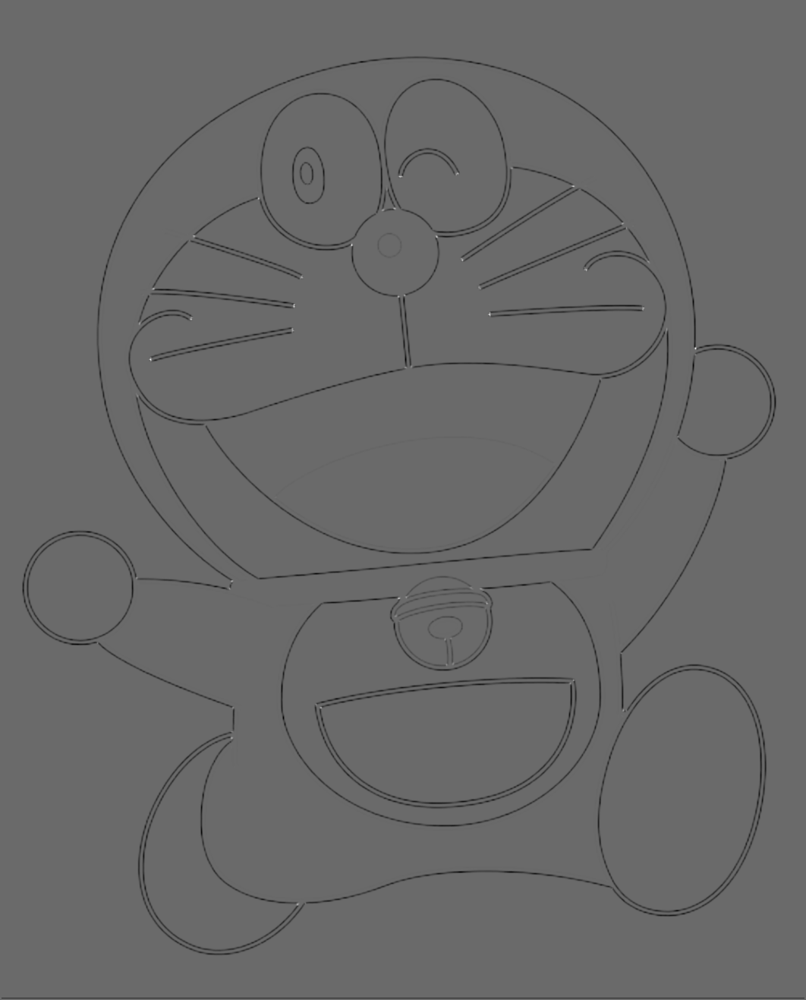
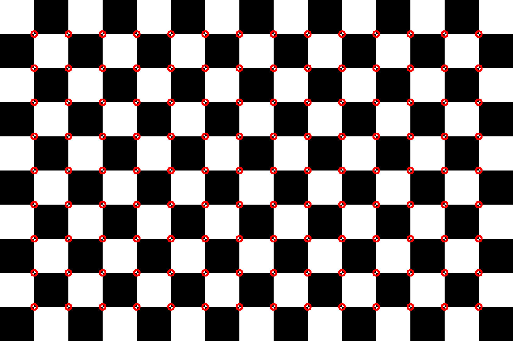
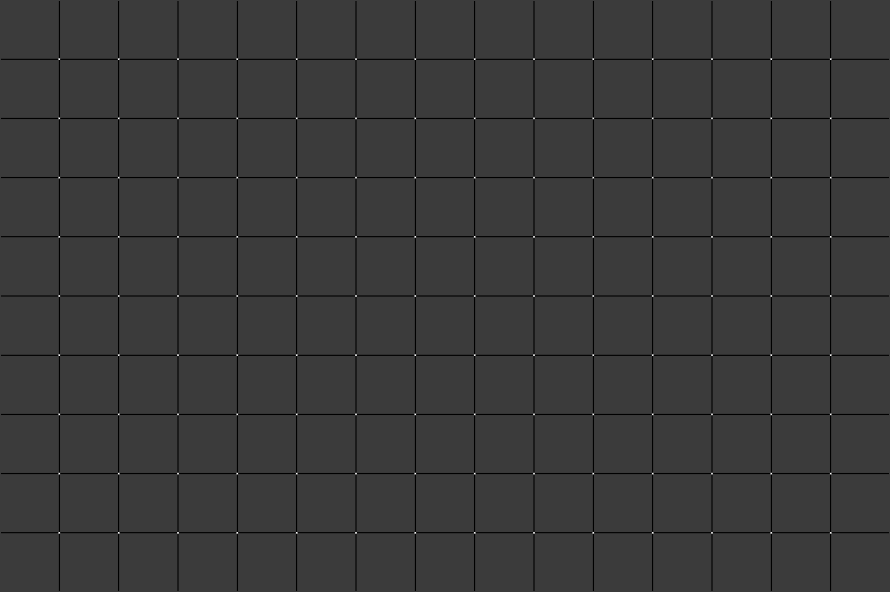
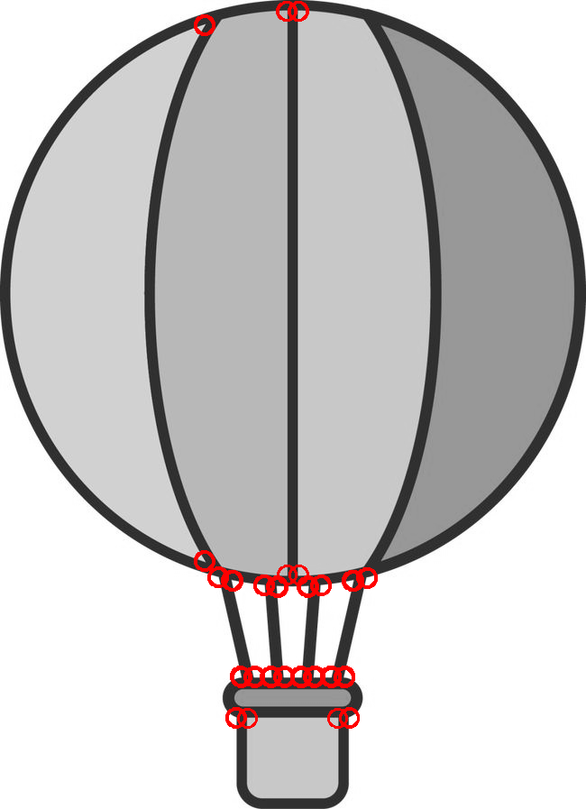
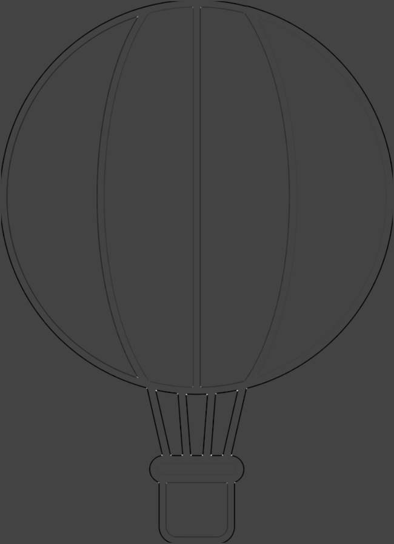

# Harris corner detector
>___Author : csl___  
>___E-mail : 3079625093@qq.com___

---
## 1.overview
### Harris algorithm is an excellent corner detection algorithm, which is often used to extract feature corners in pictures. Based on OpenCV and eigen3, the library realizes Harris corner detection by making wheels. And this library provides the output of image r value, corner mark and corner coordinate.    
---
## 2.Thridparty
>___OpenCV : OpenCV provides a real-time optimized Computer Vision library, tools, and hardware.___  

>___Eigen3 : Eigen is a C + + library that can be used for linear algebra, matrix and vector operations. It contains many algorithms.___  
## 3.Display
>___image1 : Doraemon[MARK]___

    

>___image1 : Doraemon[RVALUE]___



>___image1 : ChessBoard[MARK]___

    

>___image1 : ChessBoard[RVALUE]___



>___image1 : Hot Air Balloon[MARK]___   

  

>___image1 : Hot Air Balloon[RVALUE]___

  

## 4.Methods
>___Gaussian Template Static Class___
```cpp
    template <typename _Ty>
    class Gaussian
    {
    public:
        using value_type = _Ty;

    private:
        Gaussian() = default;

    public:
        // the max value is sigma * std::sqrt(2.0 * M_PI)
        static value_type gaussian(value_type x, value_type mean, value_type sigma);
        // the max value is 1
        static value_type gaussianNormalized(value_type x, value_type mean, value_type sigma);
    };

    template <typename _Ty>
    typename Gaussian<_Ty>::value_type Gaussian<_Ty>::gaussian(value_type x, value_type mean, value_type sigma)
    {
        return Gaussian<_Ty>::gaussianNormalized(x, mean, sigma) / (sigma * std::sqrt(2.0 * M_PI));
    }

    template <typename _Ty>
    typename Gaussian<_Ty>::value_type Gaussian<_Ty>::gaussianNormalized(value_type x, value_type mean, value_type sigma)
    {
        return std::pow(M_E, -0.5 * (std::pow((x - mean) / sigma, 2)));
    }
```

>___Harris Static Class___
```cpp
    class Harris
    {
    public:
        // type of the cornerDetector's output image
        enum class Output
        {
            RVALUE,
            MARK
        };

    private:
        Harris() = default;

    public:
        /**
         * \brief the main function
         * \param garyImg the gray image to detect
         * \param dst the output image of the function
         * \param blockSize the size of the calculateing block
         * \param alpha the value to control the R value
         * \param threshold the threshold of the R value
         * \param out the output image's type
         * \return the corner points' position in the grayImg
         */
        static std::vector<cv::Point> cornerDetector(const cv::Mat &grayImg, cv::Mat &dst, int blockSize, float alpha, float threshold, const Output out = Output::MARK);
    };
```
