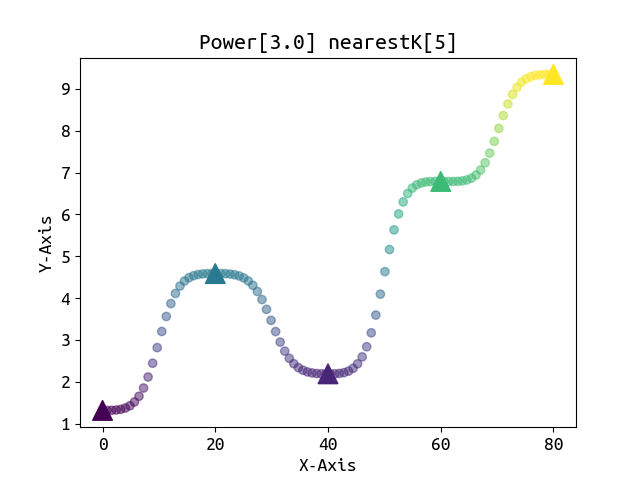
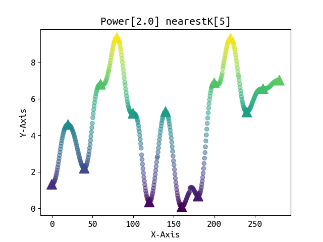
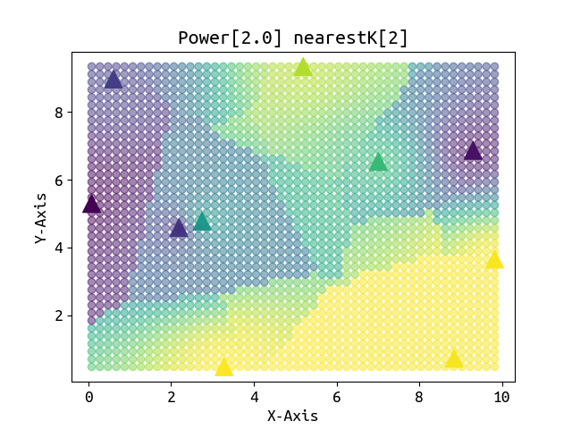
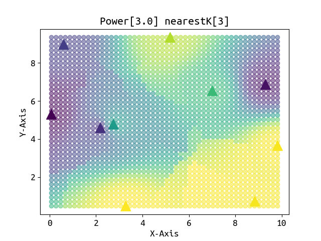
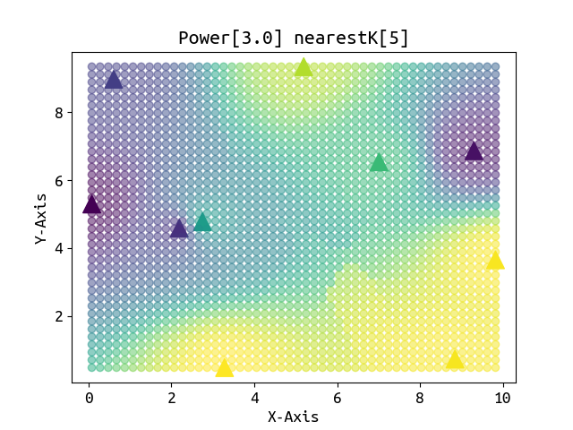
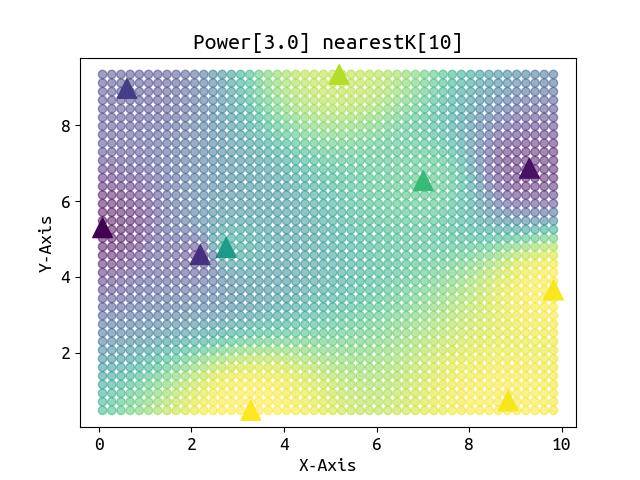
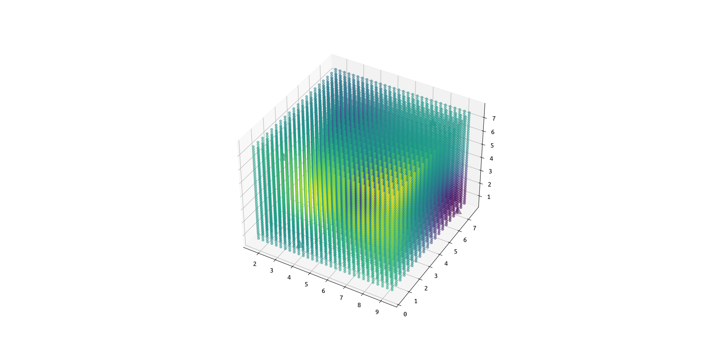
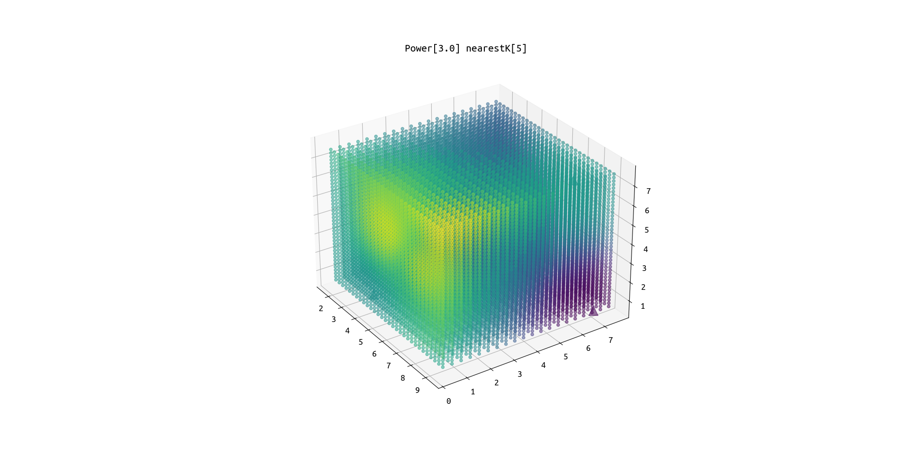
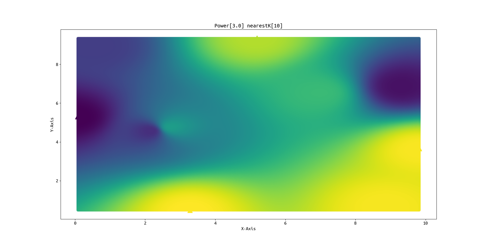

# Spatial interpolation

>___Author : csl___  
>___E-Mail : 3079625093@qq.com___  
---
## OverView
### Spatial interpolation is often used to convert the measured data of discrete points into continuous data surfaces for comparison with the distribution patterns of other spatial phenomena. It includes two algorithms: spatial interpolation and extrapolation. Spatial interpolation algorithm: deduce the data of unknown points in the same area from the data of known points. Spatial extrapolation algorithm: calculate the data of other regions through the data of known regions.
---
## Thirdparty
>___PCL___  

## Result

>___source___  
```cpp
// The first two columns are plane positions and the last column is values
2.18959,4.5865,1.31538
5.19416,9.34693,6.78865
0.0769819,5.297,0.345721
9.30437,6.86773,0.668422
7.01191,6.53919,5.26929
3.28234,0.474645,7.62198
9.8255,3.65339,7.56411
8.84707,0.726859,7.53356
2.74907,4.77732,4.36411
0.605643,8.97656,1.66507
```
>___interpolation___  
### Step One : Construct the range
```cpp
// 500 is the [x] count, and 400 is the [y] count
ns_inter::RangeConstructor rc(source, 500, 400);
```
### Step Two : Interpolation[IDW]
```cpp
// rc is the RangeConstructor, and 10 is the nearestK points, 3.0 is the power od the idw
ns_inter::InterIDW::interpolation(rc, 10, 3.0);
```
>___Result___  

  

## Details
>___RangeConstructor___  
```cpp

    class RangeConstructor
    {
        // the friend class[IDW : a interpolation method]
        friend class InterIDW;

    public:
        /**
         * \brief the point type is pcl::PointXYZI
         *        and the [x,y,z] is the position,
         *        the [i] is the reference value.
         *        if you want to do the one-dime interpolation, set [y,z] = [0.0,0.0].
         *        if you want to do the two-dime interpolation, set [z] = [0.0].
         */
        using item_type = pcl::PointXYZI;

    private:
        /**
         * \brief the _src is the source data to interpolation
         *        the _dst is points to be interpolated
         */
        pcl::PointCloud<item_type>::Ptr _src;
        pcl::PointCloud<item_type>::Ptr _dst;

    public:
        RangeConstructor() = delete;
        /**
         * \brief the source and the size in the direction
         * \attention it's for 1d data
         */
        RangeConstructor(const pcl::PointCloud<item_type>::Ptr &source, int size_x);

        /**
         * \brief point the min and max of the range by yourself
         * \attention it's for 1d data
         */
        RangeConstructor(const pcl::PointCloud<item_type>::Ptr &source,
                         int size_x, float min_x, float max_x)
            : _src(source), _dst(new pcl::PointCloud<pcl::PointXYZI>())
        {
            this->init(size_x, 1, 1,
                       min_x, 0.0, 0.0,
                       max_x, 0.0, 0.0);
        }

        /**
         * \brief the source and the size in two directions
         * \attention it's for 2d data
         */
        RangeConstructor(const pcl::PointCloud<item_type>::Ptr &source, int size_x, int size_y);

        /**
         * \brief point the min and max of the range by yourself
         * \attention it's for 2d data
         */
        RangeConstructor(const pcl::PointCloud<item_type>::Ptr &source,
                         int size_x, int size_y,
                         float min_x, float min_y,
                         float max_x, float max_y)
            : _src(source), _dst(new pcl::PointCloud<pcl::PointXYZI>())
        {
            this->init(size_x, size_y, 1,
                       min_x, min_y, 0.0,
                       max_x, max_y, 0.0);
        }

        /**
         * \brief the source and the size in three directions
         * \attention it's for 3d data
         */
        RangeConstructor(const pcl::PointCloud<item_type>::Ptr &source, int size_x, int size_y, int size_z);

        /**
         * \brief point the min and max of the range by yourself
         * \attention it's for 3d data
         */
        RangeConstructor(const pcl::PointCloud<item_type>::Ptr &source,
                         int size_x, int size_y, int size_z,
                         float min_x, float min_y, float min_z,
                         float max_x, float max_y, float max_z)

            : _src(source), _dst(new pcl::PointCloud<pcl::PointXYZI>())
        {
            this->init(size_x, size_y, size_z,
                       min_x, min_y, min_z,
                       max_x, max_y, max_z);
        }

        /**
         * \brief get the range points array
         */
        const pcl::PointCloud<item_type>::Ptr &pointArray() const { return this->_dst; }

    private:
        /**
         * \brief a function to construct the range points array
         */
        void init(int size_x, int size_y, int size_z,
                  float min_x, float min_y, float min_z,
                  float max_x, float max_y, float max_z);
    };
```

>___InterIDW___   
```cpp
    class InterIDW
    {
    public:
    private:
        InterIDW() = delete;

    public:
        /**
     * \brief a function to do the idw interpolation using nearestK search method to get points
     * \param rc the RangeConstructor contains the dst points array
     * \param nearestK the nearest points' number
     * \param power the param in the idw interpolation
     */ 
        static void interpolation(const RangeConstructor &rc, int nearestK, float power = 2.0);

    };
```
