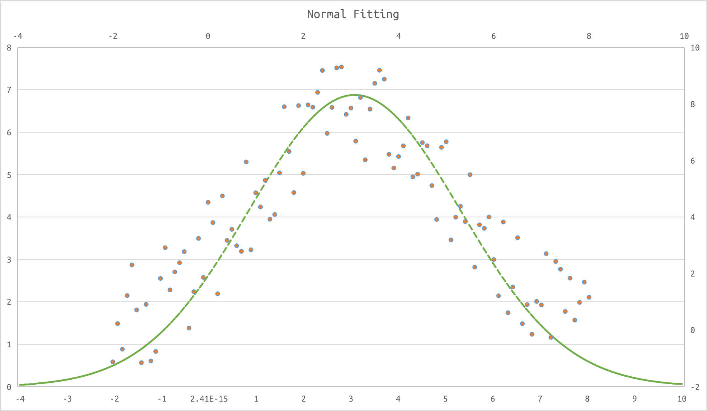

# A CPP Static Class to Fit Normal functions
>___Author : csl___  
>___E-Mail : 3079625093@qq.com___

## OverView
### This is a template cpp static class for Gaussian function fitting. It includes one-dimensional, two-dimensional and three-dimensional Gaussian data fitting.  
---

## Images


## Usage
```cpp
int main(int argc, char const *argv[])
{
    // params
    double mean_x = 5.0, mean_y = 4.0, sigma_x = 1.0, sigma_y = 4.0, rou = 0.0, A = 8;
    // generate data
    std::vector<ns_point::Point3d> vec;
    for (double x = 0.0; x < 10.0; x += 0.5)
    {
        for (double y = 0.0; y < 10.0; y += 0.5)
        {
            auto z = A * ns_gaussian::Gaussian<double>::gaussian(x, y, mean_x, mean_y, sigma_x, sigma_y, rou);
            vec.push_back(ns_point::Point3d(x, y, z));
        }
    }
    // fitting it
    ns_norm::NormalFit::two_normal_fitting(vec, mean_x, mean_y, sigma_x, sigma_y, rou, A);
    // output result
    std::cout << "mean x : " << mean_x << std::endl;
    std::cout << "mean y : " << mean_y << std::endl;
    std::cout << "sigma x : " << sigma_x << std::endl;
    std::cout << "sigma y : " << sigma_y << std::endl;
    std::cout << "rou : " << rou << std::endl;
    std::cout << "A : " << A << std::endl;
    return 0;
}
```
## thirdparty
>___Ceres___   
>___Point[personal]___  
>___Gaussian[personal]___  

## Details
```cpp
    class NormalFit
    {
    private:
        NormalFit() = delete;

    private:
        template <typename _Con>
        static void check_ary_length(const _Con &ary)
        {
            if (ary.empty())
                throw std::length_error("the array length is zero.");
            return;
        }

    private:
        struct Ceres_one_normal_fitting
        {
            const ns_point::Point2d _point;

            Ceres_one_normal_fitting(const ns_point::Point2d &point) : _point(point) {}

            bool operator()(const double *const params, double *out) const
            {
                out[0] = params[0] * std::pow(this->_point.x(), 2) + params[1] * this->_point.x() + params[2] - std::log(this->_point.y());
                return true;
            }
        };

        struct Ceres_two_normal_fitting
        {
            const ns_point::Point3d _point;

            Ceres_two_normal_fitting(const ns_point::Point3d &point) : _point(point) {}

            bool operator()(const double *const params, double *out) const
            {
                out[0] = params[0] * std::pow(this->_point.x(), 2) +
                         params[1] * std::pow(this->_point.y(), 2) +
                         params[2] * this->_point.x() +
                         params[3] * this->_point.y() +
                         params[4] * this->_point.x() * this->_point.y() +
                         params[5] - std::log(this->_point.z());
                return true;
            }
        };

    public:
        template <typename _Con = std::vector<double>>
        static bool zero_normal_fitting(const _Con &ary, double &mean, double &sigma)
        {
            NormalFit::check_ary_length(ary);
            mean = sigma = 0.0;
            mean = std::accumulate(ary.cbegin(), ary.cend(), mean);
            mean /= ary.size();
            sigma = std::accumulate(ary.cbegin(), ary.cend(), sigma, [mean](double sigma, double v)
                                    { return sigma + std::pow(v - mean, 2); });
            sigma /= ary.size();
            return true;
        }

        template <typename _Con = std::vector<ns_point::Point2d>>
        static bool one_normal_fitting(const _Con &ary, double &mean, double &sigma, double &amplitude, double thresold = 1E-10)
        {
            NormalFit::check_ary_length(ary);

            ceres::Problem prob;
            double params[3] = {0.0, 1.0, 1.0};
            for (auto iter = ary.cbegin(); iter != ary.cend(); ++iter)
            {
                if (iter->y() < thresold)
                    continue;
                ceres::CostFunction *fun =
                    new ceres::NumericDiffCostFunction<NormalFit::Ceres_one_normal_fitting, ceres::CENTRAL, 1, 3>(new NormalFit::Ceres_one_normal_fitting(*iter));
                prob.AddResidualBlock(fun, nullptr, params);
            }

            ceres::Solver::Options op;
            op.minimizer_progress_to_stdout = false;
            op.linear_solver_type = ceres::DENSE_QR;
            ceres::Solver::Summary s;
            ceres::Solve(op, &prob, &s);

            sigma = std::sqrt(-1.0 / 2.0 / params[0]);
            mean = sigma * sigma * params[1];
            amplitude = std::pow(M_E, 0.5 * std::pow(mean / sigma, 2) + params[2]) * std::sqrt(2 * M_PI * sigma * sigma);

            return true;
        }

        template <typename _Con = std::vector<ns_point::Point3d>>
        static bool two_normal_fitting(const _Con &ary,
                                       double &mean_x, double &mean_y,
                                       double &sigma_x, double &sigma_y,
                                       double &rou, double &amplitude,
                                       double thresold = 1E-10)
        {
            NormalFit::check_ary_length(ary);

            ceres::Problem prob;
            double params[6] = {1.0, 1.0, 1.0, 1.0, 1.0, 1.0};
            for (auto iter = ary.cbegin(); iter != ary.cend(); ++iter)
            {
                if (iter->z() < thresold)
                    continue;
                ceres::CostFunction *fun =
                    new ceres::NumericDiffCostFunction<NormalFit::Ceres_two_normal_fitting, ceres::CENTRAL, 1, 6>(new NormalFit::Ceres_two_normal_fitting(*iter));
                prob.AddResidualBlock(fun, nullptr, params);
            }

            ceres::Solver::Options op;
            op.gradient_tolerance = 1E-5;
            op.function_tolerance = 1E-5;
            op.minimizer_progress_to_stdout = true;
            op.linear_solver_type = ceres::DENSE_QR;
            ceres::Solver::Summary s;
            ceres::Solve(op, &prob, &s);

            rou = 0.5 * std::sqrt(params[4] * params[4] / (params[0] * params[1]));
            params[4] > 0.0 ? rou *= 1.0 : rou *= -1.0;
            auto temp_rou = std::sqrt(1.0 - rou * rou);
            sigma_x = std::sqrt(-0.5 / (params[0] * temp_rou));
            sigma_y = std::sqrt(-0.5 / (params[1] * temp_rou));

            auto B11 = 1.0 / (sigma_x * sigma_x * temp_rou);
            auto B12 = -rou / (sigma_x * sigma_y * temp_rou);
            auto B21 = -rou / (sigma_x * sigma_y * temp_rou);
            auto B22 = 1.0 / (sigma_y * sigma_y * temp_rou);
            auto A11 = params[2];
            auto A21 = params[3];

            mean_y = (B21 * A11 - B11 * A21) / (B12 * B21 - B11 * B22);
            mean_x = (B21 * A11 - B12 * B21 * mean_y) / (B11 * B21);

            auto temp = params[5] + 0.5 / temp_rou * (std::pow(mean_x / sigma_x, 2) + std::pow(mean_y / sigma_y, 2)) +
                        mean_x * mean_y * rou / (sigma_x * sigma_y * temp_rou);
            amplitude = std::pow(M_E, temp) * 2.0 * M_PI * sigma_x * sigma_y * temp_rou;

            return true;
        }
    };
```